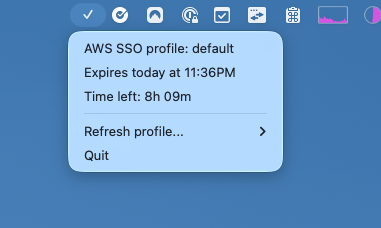
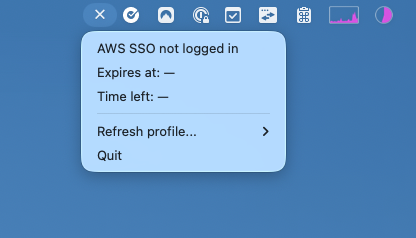

# AWS SSO Status (macOS Menu Bar App)

A small macOS menubar app that shows the expiry time of your AWS SSO session.

## Build

```bash
python3.11 -m venv venv
source venv/bin/activate
pip install -r requirements.txt
python setup.py py2app
```

## Screenshots



